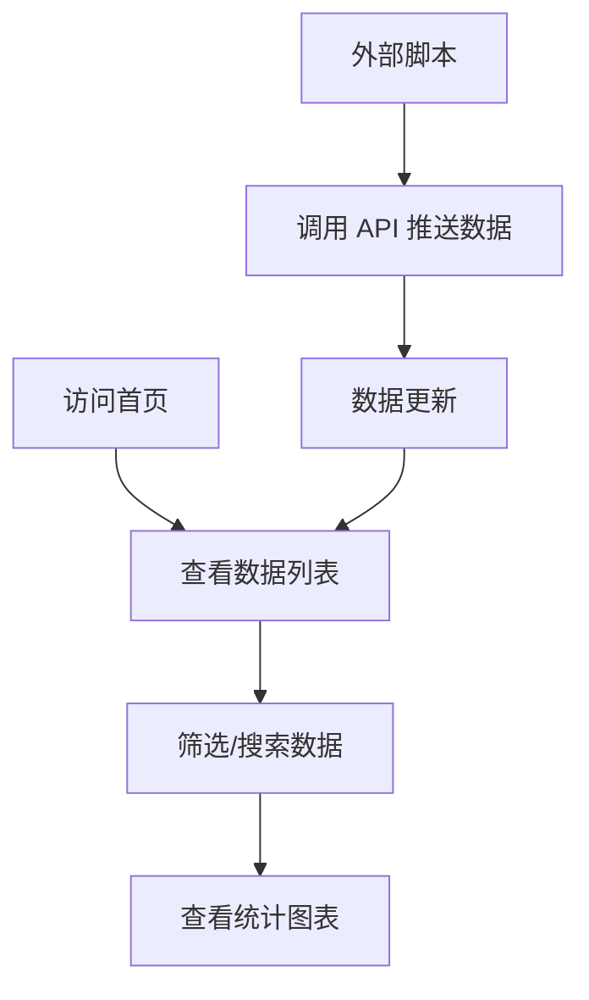

## 1. Product Overview
项目统计网页是一个数据管理和可视化平台，用于跟踪和分析项目任务的执行情况。主要解决项目管理者对任务进度、资源消耗和交付时间的监控需求，目标用户为项目管理人员和团队成员。

## 2. Core Features

### 2.1 User Roles
| Role | Registration Method | Core Permissions |
|------|---------------------|------------------|
| Admin | System setup | Full access including data management |
| User | None (public access) | View and search data |

### 2.2 Feature Module
1. **数据列表页**: 展示所有任务数据，支持筛选和搜索
2. **统计分析页**: 按人员、项目号、交付时间统计任务数量和消耗人时，图表展示
3. **数据推送接口**: 提供 API 接口供外部脚本推送更新

### 2.3 Page Details
| Page Name | Module Name | Feature description |
|-----------|-------------|---------------------|
| 数据列表页 | 数据表格 | 展示项目号、人员、个性化号、个性化内容、交付路径、消耗人时、交付时间 |
| 数据列表页 | 筛选搜索 | 支持对每个字段进行筛选和搜索 |
| 统计分析页 | 人员统计 | 按人员统计任务数量和消耗人时，柱状图展示 |
| 统计分析页 | 项目统计 | 按项目号统计任务数量和消耗人时，饼图/柱状图展示 |
| 统计分析页 | 时间统计 | 按交付时间统计任务数量和消耗人时，折线图/柱状图展示 |

## 3. Core Process
用户访问网页 → 查看数据列表 → 使用筛选和搜索功能定位数据 → 切换到统计分析页查看可视化图表 → 通过脚本调用 API 推送新数据

## 4. User Interface Design

### 4.1 Design Style
- Primary color: Deep blue (#1e3a5f) - professional, trustworthy
- Secondary color: Teal (#00b4d8) - accent for interactive elements
- Button style: Rounded corners, gradient hover effects
- Font: Inter (clean, modern sans-serif)
- Layout: Card-based with side navigation
- Icon style: Lucide icons, clean and minimal

### 4.2 Page Design Overview
| Page Name | Module Name | UI Elements |
|-----------|-------------|-------------|
| 数据列表页 | 顶部导航 | Logo, 导航菜单, 搜索框 |
| 数据列表页 | 筛选区域 | 多个筛选输入框，支持模糊搜索 |
| 数据列表页 | 数据表格 | 响应式表格，支持排序 |
| 统计分析页 | 图表区域 | 人员统计柱状图, 项目统计饼图, 时间统计折线图 |
| 统计分析页 | 统计卡片 | 汇总统计数据展示 |

### 4.3 Responsiveness
- Desktop-first design
- Tablet: Collapsible sidebar, stacked cards
- Mobile: Hamburger menu, horizontal scroll for tables

### 4.4 3D Scene Guidance
Not applicable for this project
