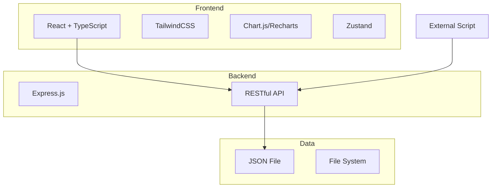
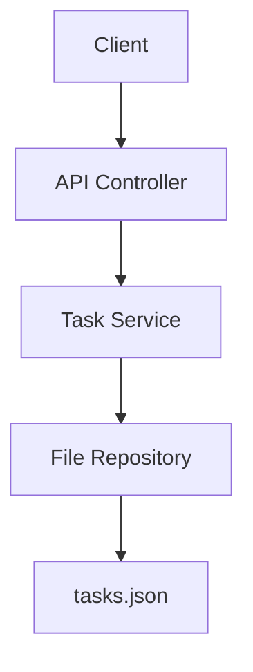
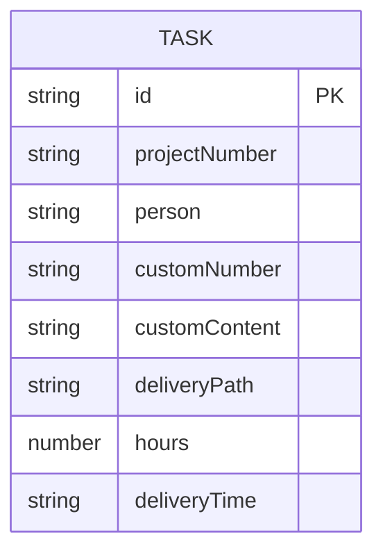

## 1. Architecture Design



## 2. Technology Description
- Frontend: React@18 + TypeScript + TailwindCSS@3 + Vite
- Backend: Express.js@4 + TypeScript
- Charting: Recharts for data visualization
- State Management: Zustand
- Data Storage: JSON file (simple, easy to manage)

## 3. Route Definitions
| Route | Purpose |
|-------|---------|
| / | 数据列表页 |
| /statistics | 统计分析页 |

## 4. API Definitions

### 4.1 Get All Tasks
- **GET** `/api/tasks`
- Response:
```typescript
interface Task {
  id: string;
  projectNumber: string;
  person: string;
  customNumber: string;
  customContent: string;
  deliveryPath: string;
  hours: number;
  deliveryTime: string;
}
```

### 4.2 Search/Filter Tasks
- **GET** `/api/tasks/search?projectNumber=&person=&customNumber=&customContent=&deliveryPath=&hours=&deliveryTime=`
- Response: Array<Task>

### 4.3 Add Task
- **POST** `/api/tasks`
- Request Body:
```typescript
interface CreateTaskRequest {
  projectNumber: string;
  person: string;
  customNumber: string;
  customContent: string;
  deliveryPath: string;
  hours: number;
  deliveryTime: string;
}
```
- Response: Task

### 4.4 Update Task
- **PUT** `/api/tasks/:id`
- Request Body: Partial<CreateTaskRequest>
- Response: Task

### 4.5 Delete Task
- **DELETE** `/api/tasks/:id`
- Response: { success: boolean }

### 4.6 Get Statistics by Person
- **GET** `/api/statistics/person`
- Response:
```typescript
interface PersonStats {
  person: string;
  taskCount: number;
  totalHours: number;
}
```

### 4.7 Get Statistics by Project
- **GET** `/api/statistics/project`
- Response:
```typescript
interface ProjectStats {
  projectNumber: string;
  taskCount: number;
  totalHours: number;
}
```

### 4.8 Get Statistics by Time
- **GET** `/api/statistics/time`
- Response:
```typescript
interface TimeStats {
  month: string;
  taskCount: number;
  totalHours: number;
}
```

## 5. Server Architecture Diagram



## 6. Data Model

### 6.1 Data Model Definition



### 6.2 Data Definition
JSON file structure:
```json
{
  "tasks": [
    {
      "id": "uuid",
      "projectNumber": "P001",
      "person": "张三",
      "customNumber": "C001",
      "customContent": "需求分析",
      "deliveryPath": "/docs/需求分析.docx",
      "hours": 8,
      "deliveryTime": "2024-01-15"
    }
  ]
}
```

### 6.3 Initial Data
- Sample data with 10+ records covering different projects, persons, and time periods
